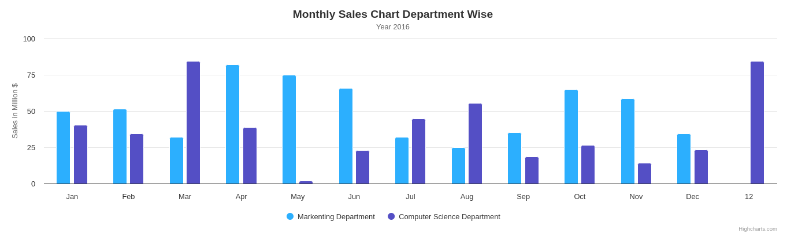

## Getting Started With Charts for your Dashboards
This is my exploration of how I could help you implment charts in you dashboards  

- HighCharts
This is a library to easily implement charts using ready made functions so that you don't have to do the hard job yourself  

* Setting up Highcharts:
You could use one of the following ways:  
- CDN
Add a CDN link to your code-base to pull the library from the internet  
- HighCharts.js
You could download this file and use it locally within the project folder  
- NutGet package
You can also browse it from the nutget package downloader  

### Screenshots
